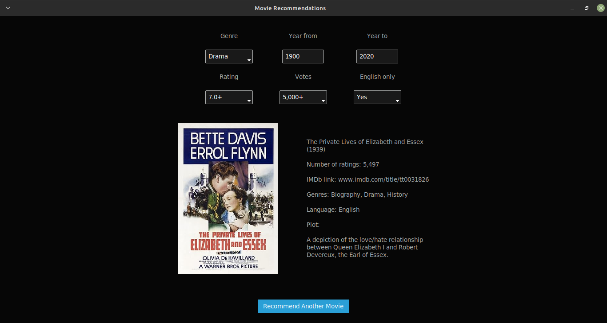

# Random Movie Generator

# 

## Table of Contents

- [Description](#description)
- [Usage](#usage)
- [Installation](#installation)

## Description

The Random Movie Generator is a desktop application that allows users to discover random movies based on various criteria such as genre, release year, rating, and more. It provides a quick and fun way to find and learn about different movies you might not have encountered otherwise.

## Usage

1. Enter your filter criteria, such as genre, release year, rating, and more.
2. Click the "Generate Random Movie" button to get a random movie recommendation that matches your criteria.
3. Explore the movie's details, including its title, release year, rating, and plot.
4. Enjoy discovering new and exciting movies with ease!

## Installation

1. Clone the repository:

```bash
git clone https://github.com/your-username/random-movie-generator
cd random-movie-generator
```

2.  Install the required dependencies:

```bash
pip install requests
pip install tinydb
pip install pillow
pip install ttkbootstrap
```

3.  Run the application:

```bash
python main.py
```
4.  Use the application to generate random movie recommendations based on your preferences.
